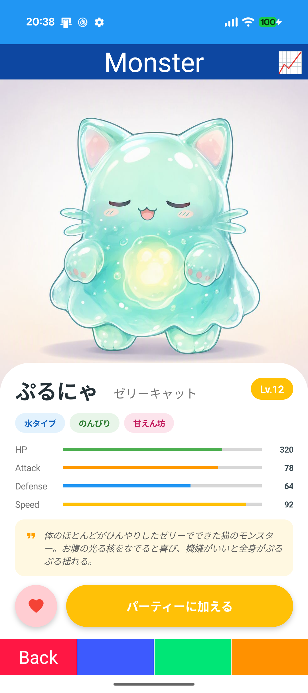
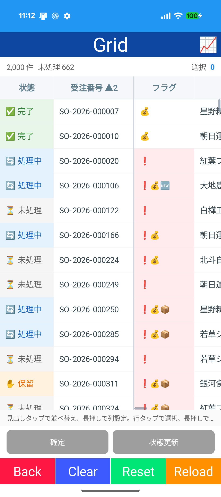
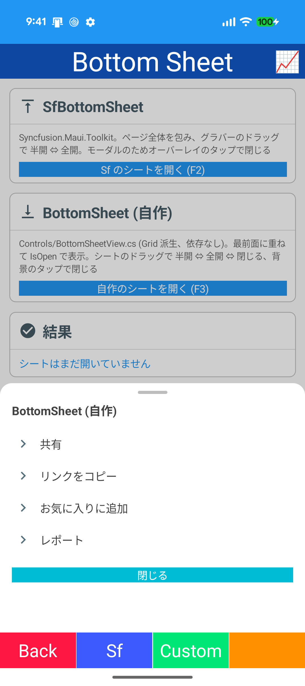
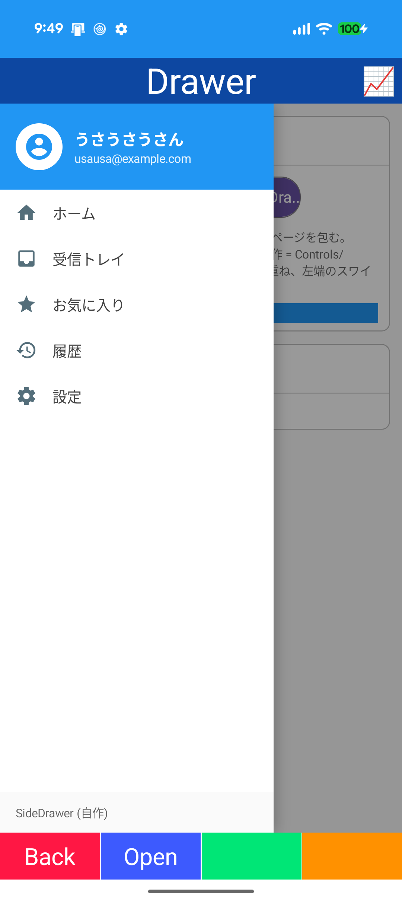
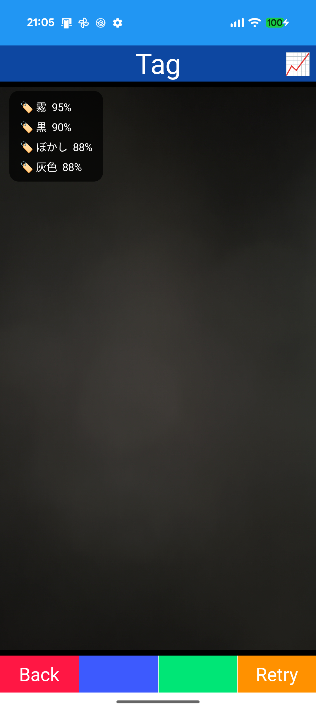

# Template project for MAUI

Template project for MAUI.

# Image

# TODO

| Category | Feature |
| --- | --- |
| Device | Biometric |
| Device | Push(FCM) |
| Network | Offline sync |
| Basic | Startup screen(progress / retry) |
| Basic | App structure(feature profile / diagnostics / catalog / lazy init) |
| Basic | .NET 10 API |
| Diagnostics | Layout metrics |
| Basic | Global xmlns |
| View | StyleClass(font size x alignment) |
| View | Material 3 |
| Device | Background task(WorkManager) |

# Implement

| Category | Feature |
| --- | --- |
| Basic | Typography / Style / Font / Converter / Behavior / Dialog / Validation / Localization / Setting |
| Navigation | Basic / Stack / Wizard / Shared / Initialize / Cancel / Dialog |
| Device | Info / Status / Sensor / Location / QR Scan(Android AI) / QR Display / Camera / OCR(Android AI) / WiFi / BLE / Bluetooth Serial / NFC / Audio / Activity / Communication / Screen / Vibrate / Feed / LED / Speak / Recognize / Local notification |
| Data | SQLite |
| Network | Web API(JWT, Data CRUD) / Storage / Realtime(SignalR) / gRPC(Chat) / SCP |
| View | Layout / Border / Shadow / Animation / Easing / Lottie / SVG / Graphics / Drawing / DragDrop / Effect / State |
| Control | Collection / Carousel / Refresh / Toolkit / Custom / Chart / SfChart / Grid(ClamGrid) / Card list / Bottom sheet(SfBottomSheet, custom) / Drawer(SfNavigationDrawer, custom) |
| Sample | Web view / HybridWebView / Map / Map2 / Media play / Markdown / PDF reader / Object detection(Local) / Object / Tag / People / OCR(Azure AI Vision) / Chat(Ollama) / Crop |
| App | Calculator / Sudoku |
| UI 1 | Profile / Login / Money / Super / POS / Shop / Item / Cart / Schedule / Calendar / Timeline / Mail / Chat / Kit(Dashboard, Notification, Setting, Onboarding, Tracking) / Graph / Graph2 / TreeMap |
| UI 2 | Stream / Dock / Load / Gauge / Meter / Mixer / Monster / Wheel / Character / Social / Radar / Flight / Tactical / Telemetry / Energy |
